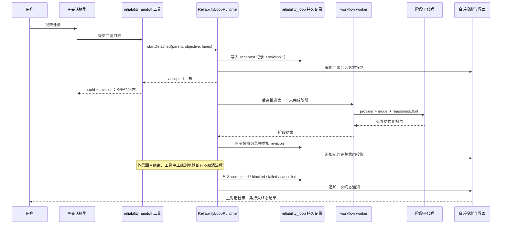

# 3081 已验证工作流能力迁移：技术与界面设计

## 状态

本文件已由用户于 2026-08-31 确认。需求以同目录下已经确认的 [requirements.md](requirements.md) 为准；实施以同目录下经确认的任务清单为准。

## 设计结论

这次修复不延长代码运行工具的十分钟上限，也不复制旧 3081 分叉的编排栈。`dsh_reliability_handoff` 只负责持久创建流程并返回启动回执；DuraSH 宿主随后独立持有实施、审查与返工。流程状态仍以 `reliability_loop` storage domain 的记录为唯一执行真源，会话日志只保存面向客户端的完整状态投影和一次终态通知，不能用于恢复或推进状态机。

模型思考强度不再由可靠性策略伪造一套全局档位。策略读取每个 provider/model 的 `resolveModelInfo()` 结果，保存并传递经过该模型能力校验的 `reasoningEffort`；worker-thread workflow 的通用 `agent()` 选项增加这一字段。`@earendil-works/pi-ai` 升级到包含 Grok 4.6 目录修正的 0.84.4，但运行时不增加 Grok 专用分支。

## 总体结构



## 模块边界

| 模块 | 责任 | 不承担的责任 |
| --- | --- | --- |
| `@durash/dsh-reliability-loop` | 持久状态机、每会话单活动流程、后台驱动所有权、暂停/恢复、取消、状态投影、终态详情 Remote | 模型目录、composer 策略、通用 workflow 执行 |
| `@durash/dsh-tool-reliability` | 校验当前直接人类回合、读取有效策略、提交目标、立即返回启动回执 | 等待终态、监听工具 abort、轮询流程 |
| `@durash/dsh-reliability-policy` | 保存每会话两条 lane，按实时模型目录验证模型和思考强度 | 硬编码 provider/model 能力、静默降级档位 |
| `@deepseek-ai/dsh-workflow-worker-thread` | 在通用 `agent()` worker 协议中传递 `reasoningEffort` | DuraSH 专用模型策略 |
| `@durash/dsh-client-ui-reliability` | 工作流策略芯片、输入框上方状态条、终态对话节点、详情/取消/关闭操作 | Runs 控制台、完整实时遥测、流程执行真源 |
| `@deepseek-ai/dsh-api-remotes` | 显式挂载可靠性流程 Remote | 复制业务校验或持久状态 |
| `@deepseek-ai/dsh-llm-pi-ai` | 使用上游模型目录并投影 provider 能力 | 为可靠性流程单独维护模型名单 |

## 持久数据

### 版本 2 记录

`reliability_loop` domain 升到版本 2。旧版本缺少会话归属、revision 与真实 lane 档位，不能安全恢复，因此不增加兼容读取或猜测迁移。版本 1 介质按仓库的预发布规则明确拒绝；实现和实时验证都不得自动删除用户现有文件。

```ts
interface ReliabilityLoopRef {
  loopId: ReliabilityLoopId
  revision: number
}

interface ReliabilityLoopLane {
  provider: string
  model: string
  reasoningEffort?: ReasoningEffortId
}

interface ReliabilityLoopRoundRecord {
  round: 1 | 2
  implementation?: ImplementAttempt
  review?: ReviewAttempt
}

interface ReliabilityLoopRecord extends ReliabilityLoopRef {
  sessionId: SessionId
  objective: string
  stage:
    | 'accepted'
    | 'implementing'
    | 'reviewing'
    | 'rework-implementing'
    | 'rework-reviewing'
    | 'completed'
    | 'blocked'
    | 'failed'
    | 'cancelled'
  implementation: ReliabilityLoopLane
  review: ReliabilityLoopLane
  rounds: readonly ReliabilityLoopRoundRecord[]
  createdAt: string
  updatedAt: string
  settledAt?: string
  error?: string
  dismissedAt?: string
}
```

每次状态、报告、终态或关闭状态条的变化都替换同一条记录并把 `revision` 增加 1。两轮报告分别保留，第二轮不覆盖第一轮证据。结构不变量拒绝缺阶段、跳轮次、终态缺 `settledAt`、非失败态带 `error`、非终态带 `dismissedAt` 等不一致记录。

### 每会话唯一活动流程

domain 仍只有一张以 `loopId` 为键的 `loops` 表，避免跨表事务。运行时打开 domain 时扫描一次记录，构建 `sessionId -> active loopId` 与 `sessionId -> newest loopId` 的内存索引；发现同一会话有两个非终态记录时插件加载失败，不任选其中一个。之后每会话串行队列同时保护启动、取消、关闭与恢复。

一个终态流程不阻止下一次启动。状态条显示该会话唯一的非终态流程；没有非终态流程时显示最新且未关闭的终态流程。关闭最新终态后不重新翻出更旧的终态记录。

## 会话事件与客户端投影

### 派生事件

新增 `reliability-loop/change` session event。事件携带完整的会话级显示状态，而不是增量；它是从 domain 记录生成的只读投影，不是流程执行真源。

```ts
interface ReliabilityLoopChange {
  version: 1
  turn: null
  current: ReliabilityLoopStatusView | null
  terminal?: ReliabilityLoopTerminalNotice
}
```

`current` 包含当前流程的 ref、stage、最多 160 个字符的目标摘要、两条 lane、时间、终态摘要与有界错误。完整目标、两轮报告和持久错误只通过受会话鉴权的详情 Remote 读取。持久错误沿用 `maxHandoffChars` 上限；更长的 provider 或 worker 原始证据留在所属 workflow/child session 日志中。`terminal` 只在某个 loop 第一次进入终态时出现，包含 loop ref、终态、结算时间和最多 800 个字符的结果摘要。

`SessionProjectionMap.reliabilityLoop` 直接折叠 `current`。每次 append 前，运行时重新从 domain 选择该会话的当前记录，因此迟到的旧流程通知不能覆盖新活动流程。domain 写入先发生，session event 后发生：如果进程在二者之间停止，下一次 `agent/created` 会比较记录 revision 与会话日志并补写最新完整投影。补写终态前还会扫描同一 loop 的既有 `terminal` 通知；session append 成功即构成一次交付，重启不会追加第二份。

新增事件需要同步更新持久事件目录、TypeScript SDK 和 Python SDK 的预期输出。流程恢复代码严禁从 session projection 读取 stage 或报告。

### 主对话终态结果

客户端为 `terminal` 通知注册一个稳定 id 为 `loopId` 的 Conversation Node。它只渲染终态通知，不渲染活动阶段；因而主对话没有实时遥测洪流。节点显示状态、摘要和“查看详情”，每个 loop 最多一条。它不额外唤醒主模型，避免为机械总结增加一次模型成本，也避免模型误触发新的 handoff。若用户需要进一步解释，可以在普通下一轮对话中询问。

## 生命周期所有权

### 快速启动

`ReliabilityLoopRuntime.startDetached()` 按以下顺序执行：

1. 在会话串行队列中确认没有非终态流程。
2. 再次验证 objective 长度与两条 lane 的完整性。
3. 写入 `accepted` revision 1 记录。
4. 创建唯一 `LoopDriver`，安装 parent Agent 生命周期暂停守卫，并把 driver 放进 `live` map。
5. 追加状态投影，然后返回 `{ loopId, revision, status: 'accepted' }`。

driver 在后台把 `accepted` 推进为 `implementing`。工具输出 schema 改为启动回执，描述和系统提示明确“不要轮询；输入框上方显示进度”。工具不读取 `handle.result`，也不为 `exec.signal` 注册取消监听。工具信号即使在记录提交后、回执到达模型前中止，流程也继续，并可由状态条找到。

工具仍只允许精确的 live root Agent 在当前 driver 内调用，但“存在过人类消息”改为“当前 open turn 的发起消息是直接人类消息”。系统通知、恢复回合和子代理不能递归创建流程。

### 终态、显式取消与暂停

`LoopDriver` 内部结算结果改成互斥的 `terminal` 或 `suspended`：

- `cancel(reason)` 只用于用户通过受鉴权 Remote 显式取消。它取消当前 workflow run，等待 worker 与子代理释放，然后持久写入一次 `cancelled`。
- `suspend(reason)` 用于 parent Agent 卸载、插件拆卸或宿主停止。它停止当前 workflow run并等待资源释放，但不修改非终态 stage；下一次恢复重跑这个第一个未完成阶段。
- 普通 provider 失败、worker 提前退出或阶段报告无效写入 `failed`，不会抛出无人观察的 Promise rejection，也不会结束 Web 宿主。

parent Agent 的 scoped effect 在 driver 获得所有权时注册，因此 parent 拆卸先请求 suspend。服务拆卸会 suspend 所有 driver，再关闭 domain。`agent/created` 同时负责首次启动时已经存在的 roots 和后续恢复：它补齐状态投影，重新持有唯一非终态流程，并从记录 stage 继续。

### 竞争规则

| 竞争 | 结果 |
| --- | --- |
| 工具 abort / 回合结束 / 浏览器断开 | 不触碰 driver；流程继续 |
| 两个并发启动 | 会话队列只接受第一个；第二个返回现有 ref |
| 阶段完成与 suspend 竞争 | 已提交的阶段转移保留；未提交的阶段在恢复后重跑 |
| 阶段完成与显式 cancel 竞争 | cancel 请求后不再启动下一阶段；最终只写一个终态 |
| domain 已写、session event 未写时崩溃 | `agent/created` 从 domain 补投影与缺失终态通知 |
| 两次恢复 | `live` map 与会话活动索引拒绝第二个写入者 |
| 客户端用旧 revision 修改状态 | Remote 返回 stale-revision，不猜测重试；只读详情仍返回最新归属记录 |

## Remote API 与授权

`ReliabilityLoopRuntime` 改为 Typert Remote service，并导出 client-safe types：

```ts
@Remote('details')
details(agent: Agent, ref: ReliabilityLoopRef): ReliabilityLoopDetails

@Remote('cancel')
cancel(agent: Agent, ref: ReliabilityLoopRef): Promise<ReliabilityLoopStatusView>

@Remote('dismiss')
dismiss(agent: Agent, ref: ReliabilityLoopRef): Promise<ReliabilityLoopRef>
```

Typert 的 `Agent` lookup 把客户端传入的 session id 解析为精确 live Agent。每个方法还会确认记录的 `sessionId` 与 Agent 一致；知道其他会话的 loop id 不授予读取或修改权限。`cancel` 与 `dismiss` 使用 revision 比较交换，stale 写入失败关闭。`details` 是只读操作，返回该 loop 的最新归属记录、完整目标和阶段报告，因此状态条关闭导致 revision 增加后，持久终态节点仍可查看；它不返回凭据、环境值或子代理未公开的原始 transcript。

`cancel` 只接受非终态当前流程；活动 driver 收敛后返回终态 view，已 suspend 的流程可直接写入取消终态。`dismiss` 只接受当前可见终态，并保留 domain 历史和主对话终态节点。新流程仍由人类消息和模型 handoff 创建，状态条不提供无确认的自动重跑按钮；紧邻状态条的 composer 是开始新目标的入口。

## 模型能力与思考强度

### 目录结构

`ReliabilityModelOption` 不再暴露全局 `thinkingLevels`，而是投影 adapter 已解析的能力：

```ts
interface ReliabilityModelOption {
  selector: string
  label: string
  provider: string
  model: string
  badges: readonly ReliabilityModelBadge[]
  reasoning?: {
    efforts: readonly LlmReasoningEffortInfo[]
    defaultEffort?: ReasoningEffortId
  }
}
```

策略面板先 `listModels(provider)`，再并行调用 `resolveModelInfo(provider, model)`；提供方之间也并行解析。单个 provider 目录失败仍与普通模型目录一样隔离，但一个模型无法解析时不会带着伪造档位进入选择器。界面按 adapter 顺序显示 effort；已知 id 使用本地化名称，未知 id 使用 adapter 名称。

### 保存与目录漂移

- 有 reasoning 元数据的模型只接受 `efforts` 中的非空 id。
- 没有 reasoning 元数据的模型只接受 `null`，界面不显示伪造选项。
- 默认值只从模型支持集合中选择：实施优先受支持的 `high`，审查优先受支持的 `xhigh`，否则使用 adapter default，再否则使用第一项；无 reasoning 时保持 `null`。
- 配置时目录不匹配直接拒绝。
- 已保存组合在升级后失效时保留原选择并在 snapshot 中标明具体错误；它不能启用或启动，但系统不静默改档或覆盖用户选择。

`enabledRoutes()` 改为异步的有效路由解析，返回 provider、model 与 `reasoningEffort`。启动前只重新列出并解析两条已选择路由，不遍历无关提供方或模型；随后把两条 lane 完整快照写入 loop 记录。进行中的流程不受后续设置变化影响。

### worker 通用传递

worker-thread workflow 的 `agent()` 支持列表、realm 校验、`ChildStartRequest` 与 Host `agentOptions` 都增加 `reasoningEffort`。可靠性脚本把 `args.reasoningEffort` 传给 `agent()`；subagent 和 LLM runtime 现有校验仍是最后一道失败关闭检查。该能力属于通用 workflow，不出现 `xai`、`grok` 或 DuraSH 专用判断。

依赖升级到 `@earendil-works/pi-ai` 0.84.4。目录回归固定 Grok 4.6 仅有 `low`、`medium`、`high`、`xhigh`，与 [xAI 官方 reasoning 文档](https://docs.x.ai/developers/model-capabilities/text/reasoning) 一致；另用不同档位集合和无 reasoning 模型证明实现是通用的。

## 长上下文与错误隔离

可靠性阶段继续通过 `workflowEngine -> spawn -> in-process driver` 创建子代理。`applyChildComposition()` 加入 parent 的同一 preset generation，所以 `token-meter`、`tool-result-pruner` 与 `compaction-basic` 应由现有通用组合继承。本次不复制旧 workflow 专用 token 执行器。

实现阶段先增加真实 `durash`/standard preset 组合回归：检查阶段 child 实际拥有三项服务，再用大工具结果和 provider 返回的 `CONTEXT_WINDOW_EXCEEDED` 驱动裁剪、压缩与重试。若回归暴露组合缺口，只修复最接近的通用 preset/subagent 组合点。不可压缩溢出、provider 流失败和 worker death 都收敛为 loop 的 `failed` 记录；测试还要证明另一个会话和 Web Host 仍可响应。

代码运行工具的 `600000ms` wall-clock ceiling 保持不变。修复的验收是 handoff 已经在这个 ceiling 之前快速返回，而后台流程不再由该工具的 signal 所有。

## 输入框上方状态条

### 信息架构

`ReliabilityStatusDock` 注册到 `conversation.input.dock`，`order: -10`，因此出现在 Todo、Goal 与 Queue 之前。没有当前流程时返回 `null`，不保留空白。

状态条只占一行：左侧状态图标与阶段，中间是单行目标摘要，右侧是动作。阶段文案为“已接管”“实施中”“审查中”“返工中”“复审中”，终态为“已完成”“需要处理”“失败”“已取消”。活动态提供“取消”和“详情”；终态提供“详情”和“关闭”。详情使用紧凑 popover 展示两条 lane、思考强度、两轮报告和错误，不在 chat 中展开完整遥测。

窄屏隐藏目标摘要，但保留阶段和主要动作。阶段变化使用 `aria-live="polite"`；终态只播报一次。所有按钮可键盘操作并有 `focus-visible`，取消需要二次确认。`prefers-reduced-motion` 下停止旋转或脉冲动画。

### 视觉方向

视觉方向是现有 DSH composer 的紧凑、工具型状态条，不引入营销卡片、渐变、表情符号或新的字体。高度目标为 36px，横向不对称布局与 GoalBar 对齐，详情 popover 复用现有 Menu/HoverCard、边框、阴影、圆角与滚动 primitive。

| 角色 | 现有 token / 参考锚点 | 用途 |
| --- | --- | --- |
| 主操作 | `--dsw-alias-state-business-primary`；浅色约 `#3964FE`、深色约 `#679EFE` | 活动图标、焦点与主要动作 |
| 表面 | `--dsw-specific-menu`；深色参考 `#2C2C2E` | 详情 popover |
| 主文字 | `--dsw-alias-label-primary`；反色参考 `#FFFFFF` | 阶段与详情标题 |
| 次文字 | `--dsw-alias-label-caption`；浅色约 `#ADB2B8`、深色约 `#81858C` | 目标摘要、时间与 lane 注释 |
| 语义状态 | 现有 success/error/warning token | 完成、失败与阻塞；CSS 不硬编码新颜色 |

策略芯片继续位于 `conversation.input.left`。状态条与设置面板共用同一个 locale namespace 和 Remote assembly，但读取来源不同：策略来自 policy Remote，运行状态来自 session projection。

## 文档设计

根 `README.md` 的首屏保持中文优先，并压缩成用户一眼能看到的三件事：按需分配实施/审查模型、成本优先的显式选择、可恢复的“实施—独立审查—有界返工—结果交付”。同一首屏继续并列“计划—实施—多路对抗性审查—统一总结”的目标流程和当前已交付范围，不能把目标写成现成功能。

实现通过后同步更新：

- `README.md`、`README.zh.md` 的首屏与开发者预览边界；
- `INTEGRATION_STATUS.md` 与中文页中的后台所有权、状态条、思考强度和通用压缩证据；
- reliability loop、policy、tool、UI、workflow worker 的 README 双语对；
- `docs/subsystems/reliability-loop.*`、`docs/subsystems/workflow.*` 及受生成器拥有的目录；
- 一份新的中英文 implemented Agent Note，记录 domain 真源、session 投影、suspend/cancel 区分及为何不复制旧编排栈。

所有文档只在对应代码与测试通过后改成现在时。README 继续明确协调、多路审查与自动成本调度尚未交付。

## 测试与验收映射

| 层 | 主要回归 | 对应需求 |
| --- | --- | --- |
| Loop unit / real storage | accepted 快速回执、每会话唯一、revision CAS、两轮记录、显式取消、suspend、重启恢复、双 owner 拒绝 | R1、R2 |
| Tool | `handle/result` 未结算也已返回；abort 不调用 cancel；只允许当前直接人类回合 | R1、R2 |
| Session projection | 完整状态折叠、旧 revision 不回退、domain/event 崩溃缝补、每 loop 一次 terminal 通知、dismiss 不删历史 | R3、R4 |
| Client | dock order、会话隔离、所有 stage/terminal、空态不占位、详情/取消/关闭、窄屏、键盘与 reduced motion | R3、R4 |
| Workflow worker | `reasoningEffort` 跨 realm、worker port 与 subagent `agentOptions`；无效类型失败关闭 | R6 |
| Policy + pi-ai | Grok 4.6 四档、不同档位模型、无 reasoning 模型、目录漂移不静默降级、lane 进入 child | R6 |
| Real composition | 阶段 child 继承 token meter/pruner/compaction；大结果裁剪；可恢复与不可恢复 overflow；worker/provider 故障不杀 Host | R5 |
| SDK / snapshot | 新 session event 的 TS/Python expected output；一条启动回执和一条终态对话结果 | R4、R5 |
| Docs | 双语配对、首页首屏、融合状态、Agent Note、生成目录 freshness | R7 |

本地验证只运行受影响包的聚焦测试、相关类型检查、DuraSH browser composition、客户端国际化与文档门禁；是否需要扩大矩阵由失败证据决定。提交或推送前按仓库 pre-push skill 选择命令，不为了提交重复已经通过的检查。

## 被拒绝的替代方案

- **把 handoff timeout 调到更大或无限。** 仍让工具拥有长时流程，不能解决回合结束、断连和进程重启。
- **把完整 loop 状态迁到 session log。** 会产生第二个执行真源并推翻已经落地的 storage-domain 状态机。
- **只用浏览器轮询 Remote。** 刷新能读到状态，但阶段更新延迟、连接生命周期复杂，且没有一次可重建的终态通知。
- **恢复旧 3081 Runs 大卡片。** 重复实时遥测、占据对话空间，也会把旧大编排控制面带回当前主线。
- **为 Grok 写特殊判断。** 修好一个模型后其他 provider 继续漂移；通用 `resolveModelInfo()` 已经是能力真源。
- **终态再调用一次模型做总结。** 增加成本、失败点和递归 handoff 风险；有界持久报告已经足够生成确定性终态节点。
- **把 GitHub Issue #1 的 vendored 升级混进同一提交。** 依赖同步与生命周期修复的风险、验证和回滚范围不同。

## GitHub Issue #1 的独立处理

Issue #1 继续作为独立工作项：在单独分支或工作树按 `vendor/README.md` 逐个核对 Cordis、Loader、Include 与 Timer 的上游差异，重新应用或退役已记录的本地修改，再运行 vendoring 规定的测试。只有兼容性证据通过才升级并关闭 Issue；否则在 Issue 记录具体阻塞和已验证版本。它不与本设计共享提交、PR 或回滚单元。
